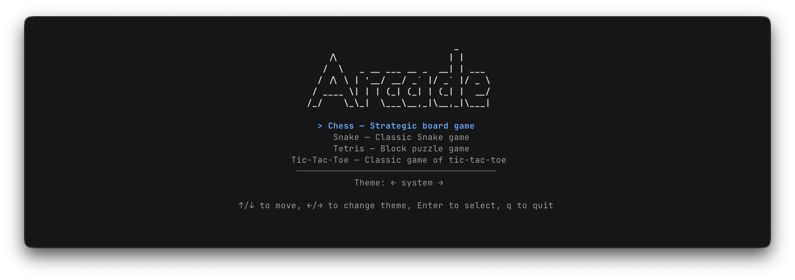
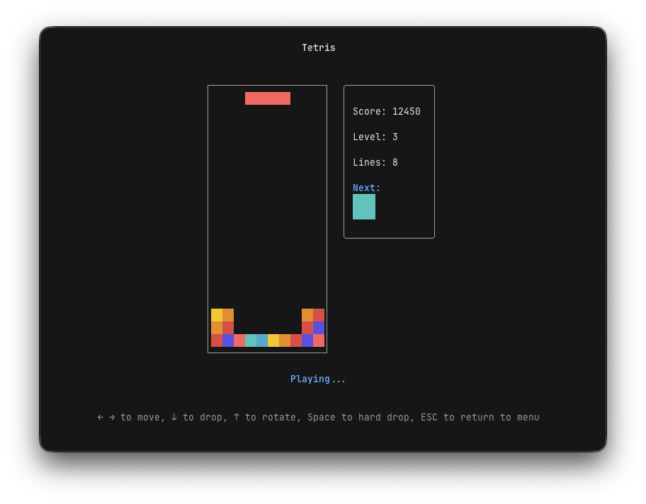

**Arcade** is a collection of classic games for your terminal, written in Go using [Bubble Tea](https://github.com/charmbracelet/bubbletea) and [Cobra CLI](https://github.com/spf13/cobra).
Play Snake, Tetris, Chess, and Tic-Tac-Toe directly from the command line - perfect for quick breaks between coding sessions.

## Features

* **Terminal Native**: Runs entirely in your terminal with rich TUI
* **Multiple Games**: Snake, Tetris, Chess, and Tic-Tac-Toe
* **Theming System**: 6 built-in themes with support for system theme detection and custom themes
* **Extensible**: Easy to add new games with consistent UI patterns

## Installation

```bash
go install github.com/jakmaz/arcade@latest
```

## Usage

### Interactive Menu
Launch the interactive game menu:
```bash
arcade
```

### Direct Game Launch
Jump directly into any game:
```bash
arcade play snake
arcade play tetris
arcade play chess
arcade play tictactoe
```

### Other Commands
```bash
arcade list                # List all available games
arcade info [game]         # Get detailed info about a specific game
arcade --help              # View all available commands and options
arcade --version           # Show version information
```

## Games

| Game | Description | Preview |
|------|-------------|---------|
| **Snake** | Classic snake game - eat food, grow longer, avoid walls |  |
| **Tetris** | Block puzzle game with falling pieces and line clearing |  |
| **Chess** | Strategic board game with full piece movement |  |
| **Tic-Tac-Toe** | Classic X's and O's game |  |

## Themes

Arcade supports multiple built-in themes with custom theme support:

- **Dracula** - Dark theme with purple accents
- **GitHub** - GitHub's dark color scheme
- **Gruvbox Dark** - Warm, retro color scheme
- **Nord** - Arctic, north-bluish theme
- **Tokyo Night** - Dark theme with neon highlights

### Custom Themes
Create custom themes by adding YAML files to `~/.config/arcade`:
```yaml
name: mytheme
palette:
  bg: "#1a1a1a"
  fg: "#ffffff"
  # ... more colors
ui:
  primary: fg
  accent: purple
  # ... UI mappings
```
You can find the structure of the theme file in [internal/theme/themes/dracula.yaml](internal/theme/themes/dracula.yaml).
If you are happy with your theme, please consider contributing it back to the project!

## Contributing

Arcade welcomes contributions! Whether you want to add new games, new themes, fix bugs, or improve the UI, your help is highly appreciated.
The ultimate goal is to make `arcade` an amazing community-driven game collection for your terminal.

### Adding a New Game

1. Create a new package in `internal/games/yourgame/`
2. Implement the Bubble Tea model interface:
   ```go
   type Model struct { /* your game state */ }
   func (m Model) Init() tea.Cmd { /* initialization */ }
   func (m Model) Update(msg tea.Msg) (tea.Model, tea.Cmd) { /* handle input */ }
   func (m Model) View() string { /* render UI */ }
   ```
3. Register your game in `internal/core/games.go`
4. Follow existing UI patterns from other games
5. Use the shared styles from `internal/ui/styles/`

## Acknowledgments

- **Theming System**: Inspired by [OpenCode](https://github.com/sst/opencode)
- **Tetris**: Inspired by [tetrigo](https://github.com/Broderick-Westrope/tetrigo)
- **Chess**: Inspired by [Gambit](https://github.com/maaslalani/gambit)
